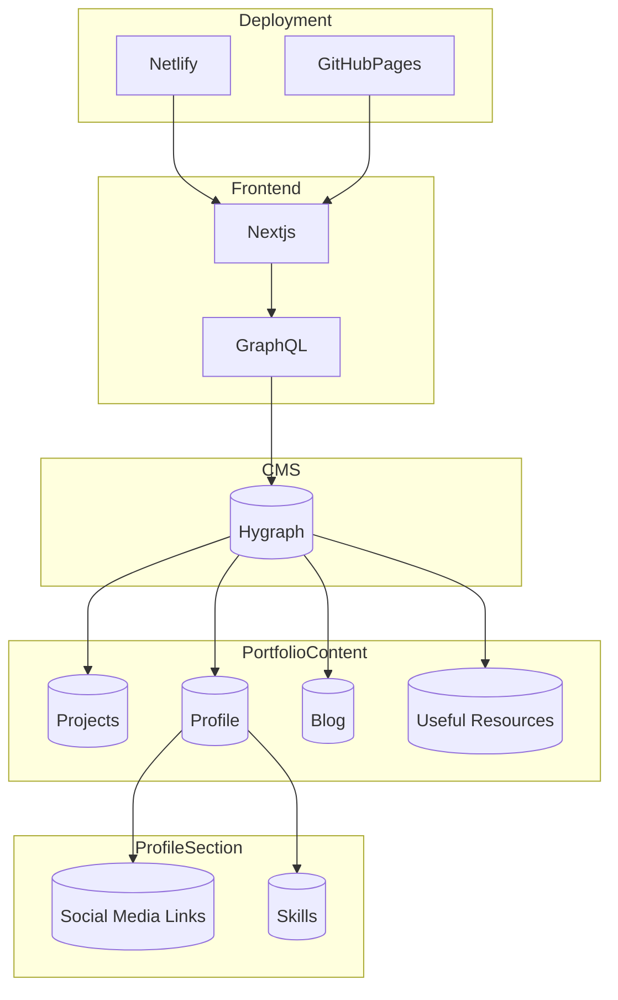

# CMS Starter Portfolio

🚧 **Under Construction** 🚧

Welcome to the CMS Starter Portfolio project! This portfolio is currently a work in progress, built with cutting-edge technologies including **Next.js**, **TypeScript**, and **Hygraph** (formerly known as GraphCMS). The portfolio will showcase a variety of dynamic content managed through the CMS. Keep an eye out for updates as the project progresses.

🔗 **Live Preview:** [sivamani-portfolio.netlify.app](https://sivamani-portfolio.netlify.app/)

If you find this project intriguing, please consider ⭐ **starring** or 🍴 **forking** the repository to stay informed about the latest developments and releases!

## Portfolio Architecture Overview

### Key Features

- **Modern Tech Stack**: Leveraging Next.js for fast, server-rendered React applications and TypeScript for type safety.
- **Content Management**: Hygraph is integrated as the CMS, providing a user-friendly interface for managing all portfolio content.
- **Flexible Deployment**: The portfolio can be deployed on both Netlify and GitHub Pages, ensuring seamless and versatile hosting options.

### NPM Libraries

This project makes use of several specialized NPM libraries to enhance the functionality and interactivity of the portfolio:

- **[react-typed.ts](https://www.npmjs.com/package/react-typed.ts)**: A customizable typing effect component for React, adding dynamic text animations to your portfolio.
- **[3DTilt](https://www.npmjs.com/package/3dtilt)**: A React component that adds a 3D tilt effect to any element, creating an engaging visual experience.
- **[magicmouse.ts](https://www.npmjs.com/package/magicmouse.ts)**: A TypeScript library for custom mouse interactions, offering smooth animations and transitions to elevate the user experience.
